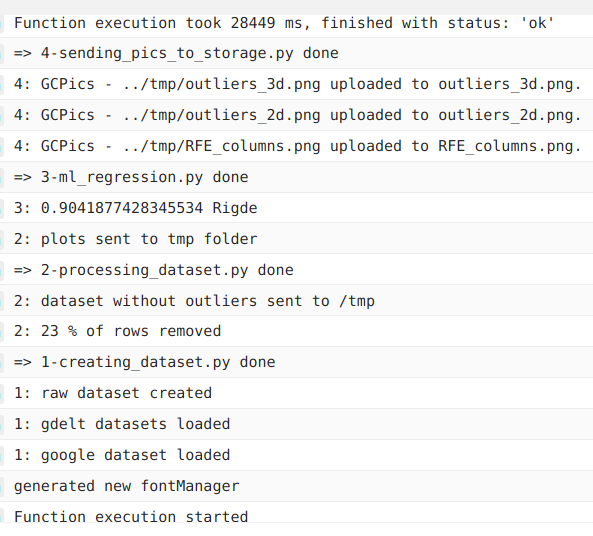
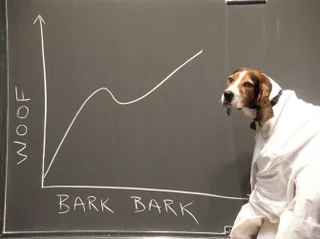

## Automated ML regression within a Cloud Function to infer unemployment searches on Google, in Spain:

----------------------------
----------------------------

### **Dashboard** => https://datastudio.google.com/s/iGEf2faYhUE

-------------------------------------
-------------------------------------

# Introduction.

I am inferring the **Trending Index** for *unemployment searches* in Google Spain.

This a leisure project to reinforce knowledge about:
- Machine Learning.
- Orchestrating a project.
- ETL automations in Google Cloud Platform.

Achievements:
- A humble but fail-safe ETL built in GCP.
- Many ML researches and data processing. 
- Final tables linked to a Data Studio dashboard.
- Continuous upgrades implemented in different branches, erased when merged to master. => https://github.com/albertovpd/automated_ML_regression/network

**Disclaimer 1:** According to the nature of requests with *Google Trends*, the model is trained every week. To check out a project with a trained ML model served within a Flask API, here there is a link => https://github.com/albertovpd/ata_inferences

**Disclaimer 2:** Typical time series problems should be addressed differently. I am using basic linear reg models because:
  - 1: This was just a fun learning project. 
  - 2: Google Trends delivers already processed data over the requested period of time. Thanks to that it is easier to infer the curve of keywords over time, but the model is not usable for further requests. 

### What is the Trending Index? How am I feeding my model?

  
Click to expand

  
- What is the Trending Index?

Outside Google, you can not know how often a keyword is searched in this Engine Search. The closer approach to that is Google Trends, which has a Python API (Pytrends), and it works as follows: 

In your selected range of time, the day/hour with more occurrences of your keyword is scored as 100%, everything else get normalized by that. This is the **Trending Index** and it means that every hour, every day the requested data data can change dramatically. For that reason, every week the whole historic up to date is requested and overwritten, so every week the real_searches curve changes and a new model of inferred_results is trained. 

- How am I feeding my model?

Taking advantage of a former leisure project ( **https://github.com/albertovpd/automated_etl_google_cloud-social_dashboard** ), I am using the gathered data to feed this ML model.

The pipeline consists of:

+ Cloud Function A: Loads data from BigQuery tables to Cloud Storage, both in EEUU region. This tables contain requested and filtered info from the Gdelt Project, to analyse online news media in Spain (news section in the automated ETL link).

- Cloud Function B (at the moment): 
  - Reads the data of Cloud Function A, and other data from a bucket in EU. This bucket contains requested info from Google Trends in Spain (Google searches section in the automated ETL link).
  - Merges datasets with different length and dates.
  - Processes them and creates a column and score for each keyword.
  - Standarize/Normalizes the final dataset.
  - Associate date with index, but dates are not in the game, so a time series problem was turned into a linear regression one. Check it out the full script explanation here.
  - Outliers removal
  - Low variance features removal
  - Performs a Recursive Feature Elimination to select the best features of 130 I have to play with.
  - Apply a linear regression to infer my keyword, in this case, unemployment. 
  - Loads results in a Cloud Storage bucket.

+ Both Cloud Functions are triggered by different Pub/Sub and Schedulers. Scripts can be found here.

+ Weekly loaded from Storage to BigQuery tables with Transfer. 

+ Plot results in Data Studio.

------------------------------------

# The Data Engineering behind.

  
Click to expand

The processes involved are shown in *Introduction*. 

### Schedulers

The ETL with which I'm feeding my project is weekly updated on Mondays. I have no rush so I'll run pipelines on Tuesdays.

- Cloud Function reading tables from BigQuery and loading into Cloud Storage bucket (USA) => 0 1 * * 2 CET (Belgium). Topic => tuesdays-reading-bq
- Cloud Function reading from Cloud Storage, applying my ML regression and delivering data again to Storage (USA) => 0 2 * * 2 CET (Belgium). Topic => reading_from_cs

- Transfer ml_regression-unemployment_inferences => Every Tue at 04:30:00 Europe/Paris => Field delimiter: ,  => Header rows: 1
- Transfer ml_regression-evolution_features => Every Tue at 04:30:00 Europe/Paris => Field delimiter: ,  => Header rows: 1
- Transfer ml_regression-weekly_score => Every Tue at 04:30:00 Europe/Paris => Field delimiter: ,  => Header rows: 1

### Creating tables in BigQuery

Now that my Cloud Function delivered the results to Cloud Storage, I need to load the data into a new dataset in BigQuery (based in USA, as my bucket).

- Create tables for every csv delivered in CS
- Advanced => Header rows to skip:1, comma separated

### Configure Transfers

Once the tables are created is necessary to configure Transfer for weekly automated updates of the tables. Beware of timing, you need to wait more or less 1 hour from loading to Storage, if don't, Transfer won't detect new files.

**WARNING:** as result of the Cloud Function output, there are new CSVs in Storage. If you modify the CF to get different fields in the CSVs, you also need to update the BigQuery tables to exactly match the new changes. If don't, transfer will fail.

### Load from BigQuery to Cloud Storage

In **cloud_function_from_bq_to_storage.py** you will find the script, and the *stack overflow* source where I found it.

Extras, configuration:

- Create a CF, name it and choose a processing capacity (study it before configuring the CF, you can have errors for not having enough capacity).
- Configure it with *PUB/SUB*, to activate it through Cloud Scheduler.
- In Advanced, select *Environmental Variables*:
    - Write all of them, keys and values, without declaring *str* type. I mean, without the quotation marks **" "**.
    - In your CF script, replace:

        project_name = "YOUR_PROJECT_ID" 
        bucket_name = "YOUR_BUCKET" 
        dataset_name = "YOUR_DATASET" 
        table_name = "YOUR_TABLE" 

    - By:
    
        project_name = os.getenv("YOUR_PROJECT_ID") 
        bucket_name = os.getenv("YOUR_BUCKET") 
        dataset_name = os.getenv("YOUR_DATASET") 
        table_name = os.getenv("YOUR_TABLE") 

---------------

# ML explanation. 

  
Click to expand

Currently, this is the process:

1-creating_dataset.py:
  - Merge 4 datasets of different lenghts, group by week.

2-processing_dataset.py:
  - Slide the *date* column, to associate data to dates 4 weeks ahead. It's a way to build the X set from which I'll infer the target *"in the future"*.
  - Remove outliers with z-score.
  - 2D and 3D representation of outliers.

3-ml_regression:
  - Remove features with low variance.
  - Standarize results (following the z-score logic).
  - Use the r² coefficient to determine the best regression model.
  - With the selected model and a dictionary of metrics, it uses a dictionary to get metrics and their associated standard deviation (cross regarding the validation buckets).
  - Plot performance vs number of features.

4-sending_pics_to_storage.py:
  - Send objects to Cloud Storage (copypasted from Googel documentation).

A Jupyter notebook of the processing part can be found here. The ML part is explained better in the cloud_function folder => https://github.com/albertovpd/viu-ai_master/blob/main/assessments/c1-data_cleaning-act_final.ipynb 

------------------------------

# Achievements.

  
Click to expand

The goal was to automate a ML model within a Cloud Function and infer data from a previous ETL. A Cloud Function has 4GB of RAM and 60 seconds of timeout, I felt it like a challenge. 

This project has room for improvement, quite a lot. Myself from the future will work refactoring the code, performing a better feature selection and optimizing everything... Or not, in the end this is a leisure project and the goal is learning. Goal accomplished.

Finally, it delivers coherent results according to the nature of my entry data, I'm happy for that, nevertheless the associated uncertainty of every metric is not valid: 
In Physics (long story short), an acceptable error is 3 orders of magnitude lower than the measurement. I think I won't be able to reach that level, but anyway,associated uncertainties must be shown, period.

# Improvements

  
Click to expand

- Cloud Function with ML regression:
    - The code is redundant. It requires refactoring.

- The ML part:
    - I would like to work with a set of fast models and implement them in the Cloud Function, so maybe every week a different model wins, and display the weekly winner in the dashboard with the rest of metrics.
    - Associated uncertainties must be improved. 
    - Perform a multiple linear regression to infer more metrics.

-----------------------------
-----------------------------

### About me:

  
Don't expand this

--------------------

- More Gdelt and ETL projects => https://github.com/albertovpd/analysing_world_news_with_Gdelt

- https://www.linkedin.com/in/alberto-vargas-pina/

----------------------

